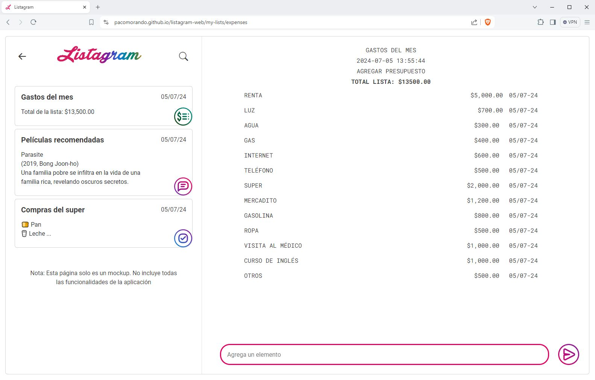
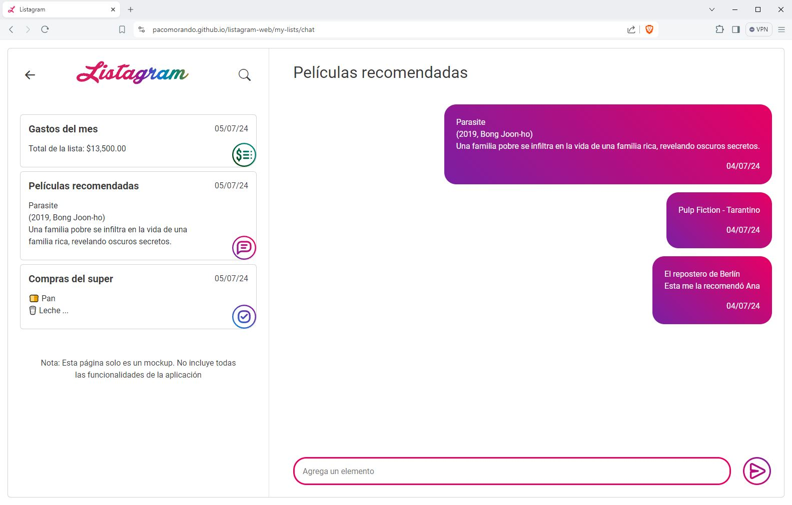
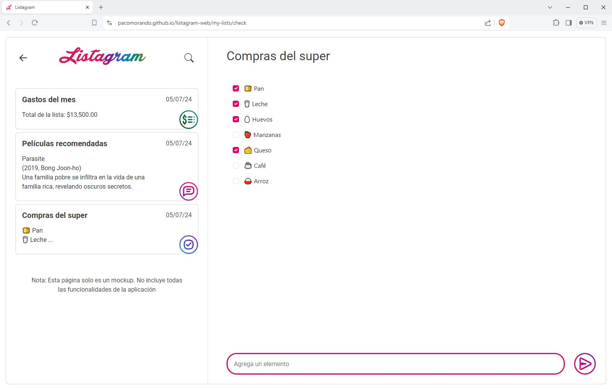
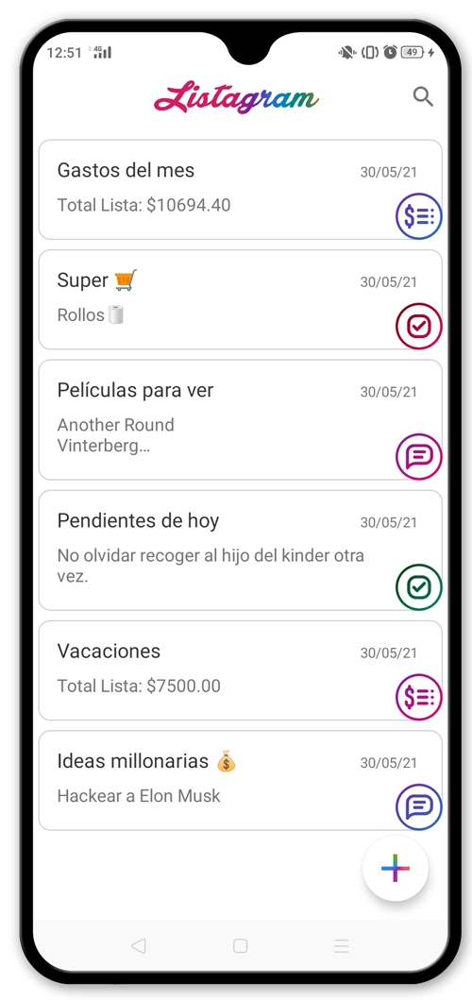
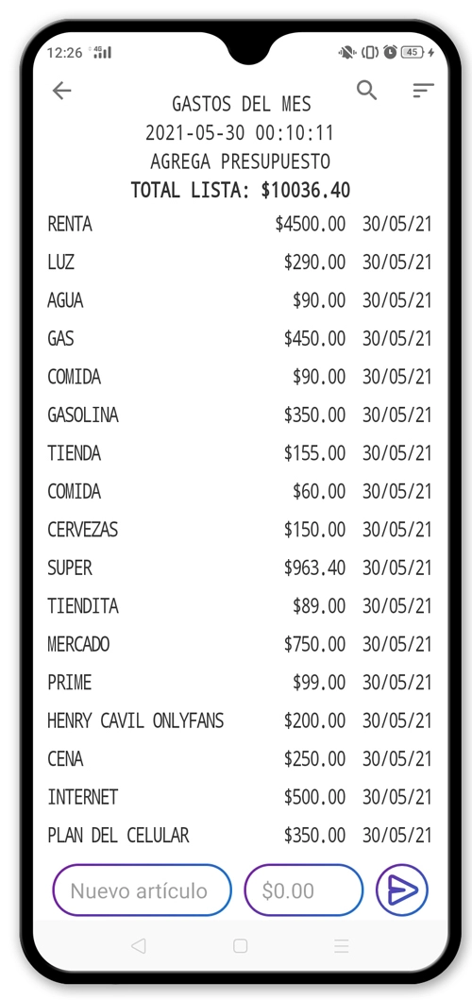
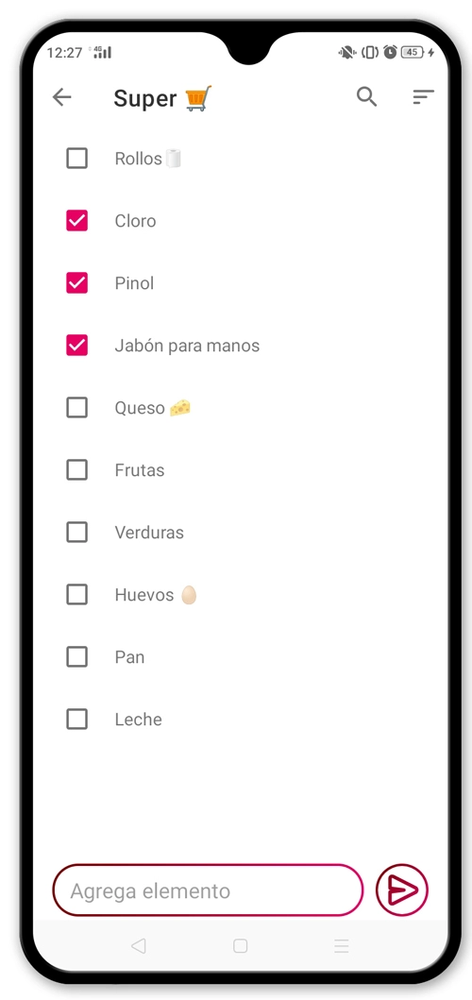
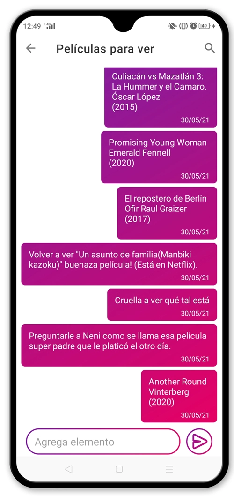

# Listagram Web (UX/UI)

## Despliegue web
### Link de la aplicación:
**https://pacomorando.github.io/listagram-web/**

La página que está desplegada actualemte solo es la maquetación de la interfaz de usuario, por lo que no todas las funcionalidades están disponibles.

**Se recomienda visualizar en un navegador web, ya que la responsividad aún está en desarrollo**

## User Interface
El objetivo principal es unificar el lenguaje del diseño de la interfaz tanto en el navegador como en la aplicación nativa, de modo que todo resulte familiar para el usuario.

A continuación la comparativa de la interfaz con la aplicación nativa para android:

La aplición se puede descargar de aquí:

**https://play.google.com/store/apps/details?id=com.sas.listagram**

El repositorio se puede consultar aquí:

**https://github.com/PacoMorando/Listagram**

|  |  |
|---|---|
|  | |

|  |  |
|---|---|
|  | |
